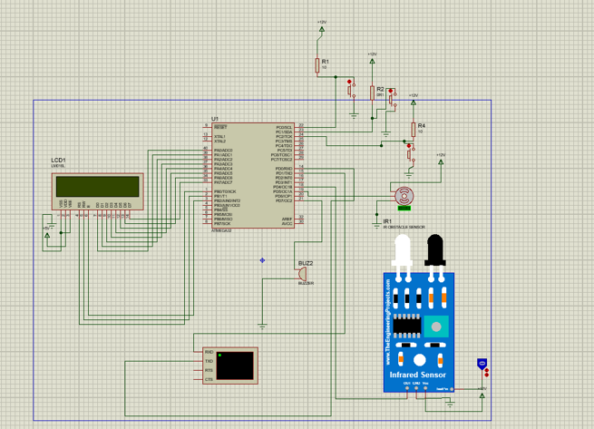

# Smart Menu Ordering System

ITI 1Month _ES track final project 

- ## Team Members

    - Youssef Elbedwehy
    
    - Manal Ibrahim
   
    - Ahmed Abdallah
    
    - Moustafa Sharaf

- ## Project Summery 

A smart restaurant menu ordering to make it
easy for a client to order and reduce the waiting time and crowd. We used an AVR microcontroller, an
Atmega32, character LCD ,servo motor ,an IR sensor and a keypad. UART is the communication protocol
used to send the order details to cashair

- ## The project consists of two systems connected via UART protocol :
1. Customer which deals with LCD, push buttons to make an order 
2. Cashier which is connected to The PC or laptop that takes order number and price

- ## SIMULATION

- ### On Proteus:

<video src="Simulation/Media1.mp4" width="1136" height="772" controls>
  Your browser does not support the video tag.
</video>

- ### HW Simulation:

<video src="Simulation/Media2.mp4" width="848" height="480" controls>
  Your browser does not support the video tag.
</video>

